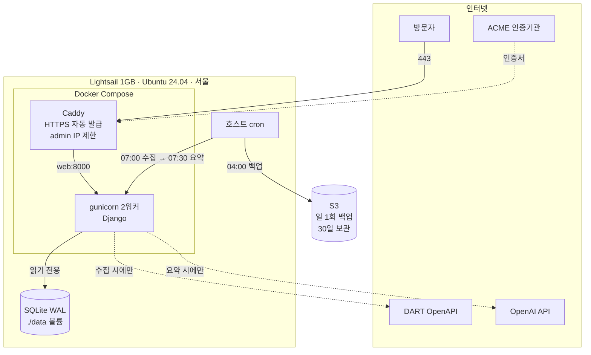

# 배포 이야기 — 1만 원으로 공개 서비스 올리기

DART 공시 요약 서비스를 AWS Lightsail에 배포한 과정과 그 판단 근거를 정리한 문서다.

**이 문서는 "무엇을 왜 이렇게 만들었나"를 다룬다.** 실제 운영 절차(구축 명령, 장애 대응,
복원)는 [`docs/RUNBOOK.md`](docs/RUNBOOK.md)에, 전체 기획과 로드맵은
[`PLAN.md`](PLAN.md)에 있다.

- 서비스: <https://dartaisite.duckdns.org>
- 배포일: 2026-08-27
- 월 운영비: **약 $8.5 (11,800원)**

---

## 1. 한 줄 요약

> Lightsail 1GB 한 대에 Docker Compose로 **웹 + HTTPS**를 올리고,
> 호스트 cron이 매일 아침 **수집부터 AI 요약까지 무인으로** 돌리며,
> 매일 새벽 SQLite를 S3로 백업한다.

서버는 한 대다. 데이터베이스 서버도, 로드밸런서도, 메시지 큐도 없다.
**그게 이 프로젝트에 맞는 크기이기 때문이다.**

---

## 2. 구성



**핵심은 점선 두 개다.** 방문자 요청은 DART나 OpenAI를 절대 호출하지 않는다.
웹은 로컬 SQLite만 읽는다. 외부 API는 cron 파이프라인에서만 부른다.
이 원칙([PLAN.md](PLAN.md) 12.1) 덕분에 **트래픽이 늘어도 API 호출과 비용은 그대로다.**

호스트에 열린 포트는 22 · 80 · 443뿐이다. gunicorn은 컴포즈 네트워크 안에만 있어
바깥에서 직접 닿을 수 없다.

---

## 3. 왜 이 구성인가

이 프로젝트를 **실제로 측정한 값**에서 출발했다. 일반론이 아니라 이 숫자들이 구성을 정했다.

| 측정한 것 | 값 | 이게 뜻하는 것 |
|---|---|---|
| 웹 요청 경로 메모리 | **45MB** | `views.py`가 tiktoken·openai를 import하지 않는다 → 웹은 가볍다 |
| 동시 쓰기 주체 | **1** | `views.py`에 쓰기 코드가 0줄 → 웹은 읽기 전용이다 |
| 데이터 | 1,114행 / 11MB | 데이터베이스 서버를 따로 둘 규모가 아니다 |
| 월 요약 대상 | 약 45건 | 메시지 큐를 둘 규모가 아니다 |
| 요약 1건당 비용 | $0.023 | 상한만 걸면 비용 사고가 안 난다 |

### 결정과 근거

| 선택 | 대신 쓸 수 있던 것 | 왜 이걸로 |
|---|---|---|
| **Lightsail** | EC2 | 같은 1GB에 $7 vs $11.6. EC2는 공인 IPv4·EBS·전송이 따로 청구된다. 스냅샷 → EC2 내보내기가 공식 지원되어 나중에 옮길 수 있다 |
| **SQLite** | PostgreSQL | 쓰기 주체 1 · 데이터 11MB · 웹은 읽기 전용. SQLite 종속 코드가 **0건**임을 확인했다(원시 SQL 0 · 대소문자 의존 쿼리 0) → 필요해지면 반나절에 전환 |
| **cron** | Celery + Redis | 월 45건에 브로커는 과설계. 쓰기 주체가 둘이 되는 7단계에 도입한다 |
| **Caddy** | nginx + certbot | HTTPS 발급·갱신이 자동. 설정 30줄이 5줄이 된다 |
| **Docker** | 직접 설치 | 서버 재구축이 `git clone` + `docker compose up` 두 줄이 된다 |
| **Ubuntu 24.04** | Amazon Linux 2023 | 앱이 컨테이너 안에서 도니 OS는 호스트 도구만 좌우한다 → 자료가 많은 쪽이 낫다 |
| **whitenoise** | S3 정적 호스팅 | CSS 2개 + JS 1개. CDN을 붙일 규모가 아니다 |

### 관리형 DB를 안 쓴 이유

RDS나 Lightsail 관리형 DB를 붙이면 월 $8이 $23~27이 된다. 그 돈이 막아주는 손실이 무엇인지
따져봤다. **원문은 DART에 있고 요약은 다시 만들 수 있다.** 최악의 경우 잃는 것은
요약 재생성 비용 $3과 반나절이다. 월 $15를 더 내고 막을 손실이 아니다.

대신 **일 1회 S3 백업 + 일 1회 스냅샷**으로 최대 24시간까지 손실을 제한했다.

### 언제 이 판단을 다시 하나

SQLite는 "지금이 1인·읽기 전용·11MB이기 때문에" 맞는 선택이지 영구 결정이 아니다.
아래 중 하나라도 발생하면 PostgreSQL로 전환한다.

1. **Celery 워커를 별도 프로세스로 분리**할 때 (7단계) — 쓰기 주체가 2개 이상이 된다
2. **웹 서버를 2대 이상**으로 늘릴 때 — 파일 DB는 인스턴스 간 공유가 안 된다
3. **웹에서 쓰기 기능**을 추가할 때 (계정·댓글·구독)
4. **공시 검색**을 붙일 때 — 한국어 전문 검색은 PostgreSQL이 유리하다

---

## 4. 배포 과정

| 단계 | 한 일 | 산출물 |
|---|---|---|
| **0. 문서** | 구성 확정, 기각한 대안과 근거 기록 | `PLAN.md` 9.2 |
| **1. 컨테이너화** | AWS 없이 로컬에서 운영 설정으로 검증 | `Dockerfile` · `docker-compose.yml` · `Caddyfile` |
| **2. AWS 리소스** | 인스턴스 · 고정 IP · 방화벽 · S3 · IAM · DuckDNS | — |
| **3. 배포** | clone → `.env` → `docker compose up` | HTTPS 공개 URL |
| **4. 자동화** | cron 등록, 백업 스크립트 | `deploy/crontab` · `deploy/backup.sh` |
| **5. 검증** | 백업 무결성, 접근 제어, 실측 기록 | `docs/RUNBOOK.md` |

**1단계에서 AWS를 쓰지 않은 것이 중요했다.** 컨테이너를 로컬에서 `DEBUG=false`로 띄워
테스트 333건과 화면·admin 차단까지 확인한 뒤에 서버로 갔다. 그래도 실배포에서 새 문제가
나왔지만(아래), 그 수는 훨씬 적었다.

---

## 5. 실제로 막혔던 것들

문서에 남길 가치가 가장 큰 부분이다. 전부 **로컬에서는 보이지 않던 문제**다.

### 1. `SITE_DOMAIN=http://example.com` — 조용히 HTTPS가 꺼진다

Caddyfile에서 사이트 주소에 스킴을 붙이면 **"그 프로토콜로만 서비스하라"는 유효한 지시**가
된다. 오류가 아니므로 아무 경고 없이 인증서 없는 상태로 뜬다. 로그의 이 한 줄이 유일한 단서였다.

```
"server is listening only on the HTTP port, so no automatic HTTPS will be applied"
```

도메인 관련 환경변수 세 개는 형식이 다 다르고, 그 차이에는 이유가 있다.

| 항목 | 형식 | 무엇과 비교되나 |
|---|---|---|
| `SITE_DOMAIN` | `example.com` | Caddy 사이트 주소 |
| `DJANGO_ALLOWED_HOSTS` | `example.com` | HTTP **Host** 헤더 (스킴이 없다) |
| `DJANGO_CSRF_TRUSTED_ORIGINS` | `https://example.com` | **Origin** 헤더 (스킴이 있다) |

### 2. 헬스체크가 영원히 실패한다

컨테이너 헬스체크를 `http://127.0.0.1:8000/`로 호출하게 짰다. 그런데 `ALLOWED_HOSTS`에는
서비스 도메인만 있으니 Django가 `400 DisallowedHost`로 답한다. **컨테이너가 계속
unhealthy로 남는다.**

로컬 검증에서는 오버레이 설정이 `ALLOWED_HOSTS`에 `127.0.0.1`을 넣어줘서 드러나지 않았다.
**검증 환경이 운영과 달랐던 것이다.**

`ALLOWED_HOSTS`에 루프백을 추가하면 간단하지만 Host 헤더 검사를 그만큼 헐겁게 만든다.
헬스체크가 Host 헤더를 맞춰 보내도록 고쳤다([`deploy/healthcheck.py`](deploy/healthcheck.py)).

### 3. `source .env`가 스크립트를 죽인다

백업 스크립트가 `set -a; source .env`로 설정을 읽고 있었다. `.env`의 값은 따옴표 없이
적히는데, Django의 `SECRET_KEY`에는 `(` `)` `$` `#` `&` `*` 가 들어간다.
**셸이 이걸 문법으로 해석해서 값이 잘리거나 문법 오류로 죽는다.**

`=`의 첫 등장만 기준으로 잘라 값을 그대로 넘기는 로더를 따로 만들었다
([`deploy/_load_env.sh`](deploy/_load_env.sh)). 읽는 키도 백업에 필요한 4개로 제한했다 —
API 키를 백업 프로세스의 환경에 올릴 이유가 없다.

### 4. Windows에서 개발하고 Linux에서 실행할 때

`core.autocrlf=true` 환경에서 셸 스크립트가 CRLF로 체크아웃되면, 컨테이너가
`#!/bin/sh` 뒤의 캐리지 리턴을 해석하지 못해 **`exec format error`로 죽는다.**
실행 권한도 Windows git은 기록하지 않는다.

[`.gitattributes`](.gitattributes)로 줄바꿈을 못 박고, 실행 권한은 인덱스에 명시하고,
엔트리포인트는 이미지 빌드 중에 `chmod +x`를 다시 걸었다.

### 5. 도커 로그는 무제한으로 쌓인다

배포하고 몇 초 만에 크롤러와 IP 스캐너가 붙었다. 인증서를 발급받으면 도메인이
**공개 기록(Certificate Transparency)** 에 남기 때문이다.

Caddy는 요청 하나당 수 KB짜리 JSON을 남기고, 도커 기본 로그 드라이버에는 크기 제한이 없다.
놔두면 40GB 디스크가 찬다. 서비스가 죽는 방식 중 가장 허무한 축이라 상한을 걸었다.

### 6. 계획과 콘솔이 다를 때

스냅샷을 "주 1회"로 설계했는데 Lightsail 자동 스냅샷은 **주기를 고를 수 없다.**
일 1회·7개 보관 고정이고 시각만 정한다.

수동 주간으로 낮출 수 있었지만, **사람이 기억해야 하는 백업은 결국 안 하게 된다.**
월 $0.2를 더 내고 자동 일간을 택했다. 계획서보다 콘솔이 옳다.

---

## 6. 보안

| 조치 | 내용 |
|---|---|
| **admin IP 제한** | 지정한 IP 외에는 `/admin/*`에 **본문 없는 404**. `403`이나 꾸며진 404는 "여기 뭔가 있다"는 단서가 된다 |
| **입구에서 차단** | Caddy가 막으므로 Django는 그런 요청이 있었는지도 모른다 |
| **gunicorn 비노출** | 호스트 포트를 열지 않는다. 열면 IP 제한을 우회하고 `X-Forwarded-Proto`를 위조할 수 있다 |
| **최소 권한 IAM** | 백업 전용 사용자에 버킷 하나의 `db/` 접두사만. **`DeleteObject`가 없어 키가 유출돼도 기존 백업을 지울 수 없다** |
| **비루트 실행** | 컨테이너는 uid 1000으로 돈다 |
| **SSH 제한** | 22번은 내 IP만. 브라우저 SSH를 함께 허용해 잠겨도 복구 가능 |
| **HSTS 미적용** | 브라우저가 정책을 캐시해 되돌리기 어렵다. 운영이 안정된 뒤 별도 검토 |

검증은 **양방향으로** 했다. 차단만 확인하면 "전부 막힌 것"과 구분되지 않는다.
허용 IP에서 200, 다른 IP에서 404가 나오는 것을 로그로 확인했다.

---

## 7. 비용 통제

**요약 생성은 이 프로젝트에서 유일하게 돈이 나가는 경로다.** 그 명령을 사람이 아니라
cron이 자동으로 부르게 되므로, 안전장치를 3중으로 걸었다.

1. **`--limit 20`** — 평소 하루 1~2건이지만 백필로 대상이 밀리면 상한 없이 다 태운다.
   상한에 걸려도 하루 $0.46에서 멈춘다
2. **AWS Budgets** 월 $15 알림
3. **OpenAI 사용량 한도**

### 월 비용

| 항목 | 금액 |
|---|---|
| Lightsail 1GB | $7.00 |
| 자동 스냅샷 | 약 $0.45 |
| S3 백업 | $0.01 |
| LLM (월 45건 × $0.023) | 약 $1.00 |
| DART OpenAPI | **무료** |
| **합계** | **약 $8.5** |

---

## 8. 실측

2026-08-27, 배포 직후 유휴 상태.

| 항목 | 값 |
|---|---|
| 호스트 메모리 | **549MB 사용 / 911MB 가용** (스왑 2GB 중 76MB) |
| 컨테이너 | web **113MB** + Caddy **26MB** |
| 이미지 | 364MB |
| DB | 5.8MB · 백업(gzip) 1.06MB |
| 데이터 | 기업 10 · 공시 963 · 요약 140 |
| 테스트 | 334건 통과 |

**예산은 상시 445MB였는데 실측이 549MB다.** 컨테이너는 예상대로였으니 초과분 100MB는
호스트 쪽(Docker 데몬·snapd)이다. 요약 피크(+157MB)를 더하면 약 706MB — 가용 메모리의 78%다.
여유는 있지만 넉넉하진 않아, 30분마다 `free`를 기록하는 cron으로 추이를 지켜본다.

---

## 9. 운영 원칙

1. **서버에 SSH로 접속해 파일을 직접 고치지 않는다.**
   모든 변경은 저장소에 커밋 → `git pull` → 재배포. 예외는 `.env` 하나뿐이다.
   이게 지켜져야 "저장소 + S3 백업만으로 재구축"이 성립한다.
2. **복원을 실제로 해본다.** 복원해본 적 없는 백업은 백업이 아니다.
   S3에 있다는 것과 쓸모 있다는 것은 다르다 — 받아서 열고 `PRAGMA integrity_check`까지 했다.
3. **볼륨 마운트를 확인한다.** 빠뜨리면 재배포마다 요약 140건이 사라진다.

---

## 10. 법적 검토

공개 배포는 DART 데이터의 재배포에 해당하므로
[OpenDART 이용약관](https://opendart.fss.or.kr/intro/terms.do)을 확인했다.
**금지 조항은 없지만 명시적 허용도 없다.** 재배포·출처표시·상업적 이용에 관한 조항이
아예 없고, 사이트에 공공누리 표시 없이 저작권이 `all rights reserved`로 적혀 있다.

그래서 보수적으로 갔다. 자세한 내용은 [PLAN.md 10.1](PLAN.md)에 있고, 요지는 이렇다.

- 명확한 의무는 **인증키를 제3자가 쓰게 하지 말 것**(제19조) 하나다 → 서버 `.env`에만 둔다
- 약관 제23조는 **금융감독원조차 공시정보의 정확성을 보장하지 않는다**고 밝힌다.
  원본부터 무보증인데 우리는 AI 가공을 한 겹 더 얹으므로 면책이 이중으로 필요하다
- **가장 실질적인 위험은 저작권이 아니라 오인이다.** 출처만 적으면 공식 서비스로 읽힌다
  → "금융감독원과 무관한 개인 프로젝트"임을 전 페이지에 상시 노출한다

---

## 11. 재현하려면

```bash
git clone <저장소> DART-project && cd DART-project
cp .env.example .env && nano .env
mkdir -p data && sudo chown -R 1000:1000 data
docker compose up -d --build
```

서버 준비(스왑·Docker·AWS CLI)와 AWS 리소스 생성 절차는
[`docs/RUNBOOK.md`](docs/RUNBOOK.md) 2장에 단계별로 있다.

도메인 없이 로컬에서 운영 설정만 확인하려면:

```bash
docker compose -f docker-compose.yml -f docker-compose.local.yml up -d --build web
# http://127.0.0.1:8000/
```

---

## 12. 다음 단계

7단계(준실시간화)에서 적응형 폴링과 푸시를 얹으면서 아래를 함께 검토한다.

- **Celery + Redis** 도입 — cron으로는 분 단위 적응형 스케줄을 표현하기 어렵다
- **PostgreSQL 전환** — Celery 워커를 분리하면 쓰기 주체가 2개가 된다 (3장 전환 트리거 1번)
- **EC2 이전** — IAM 역할을 붙일 수 있어 `.env`의 AWS 액세스 키를 없앨 수 있다
- **도메인 구입** — DuckDNS를 대체한다. `.env` 세 줄과 재배포로 끝난다
